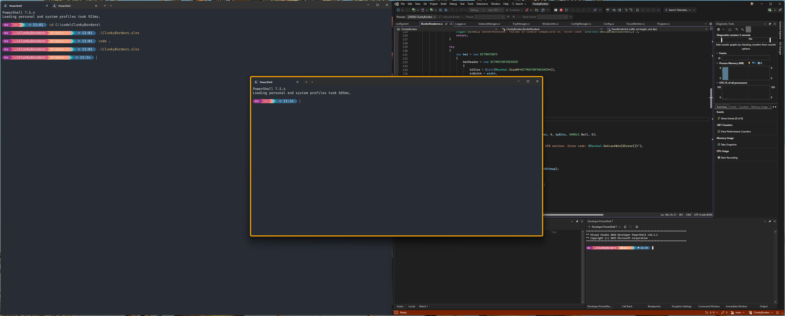

# ClunkyBorders



It’s a lightweight Windows 11 utility that adds a colored border around the currently focused window. This makes it easy to see which window is active, especially when you have several apps open at once.

The application uses native Windows APIs, keeping it small (~3MB) and efficient.

## Why ClunkyBorders?

Modern Windows styling doesn’t provide a clear or consistent indicator for the active window. When working with several apps side by side, it’s easy to start typing only to realize the input went to the wrong application.

While searching for a solution, I found [*JankyBorders*](https://github.com/FelixKratz/JankyBorders), which works great—but it’s only available on macOS.

I couldn’t find a comparable tool for Windows. The closest option was the built-in Windows accent color feature, but it didn’t meet my needs:

- The border is too thin.
- The border color is tied to the title bar color, so changing one changes both.
- Many applications ignore the accent color entirely, leading to inconsistency.

So, I decided to spend a few fun evenings building my own solution 🙂

## Usage 

## Configuration

## Build

To build and run the project, use:

```ps
dotnet build
dotnet run 
```

To generate a standalone executable, run:

```ps
dotnet publish -c Release
```

## Todo

- parameter with config file path and name
- log configuration validation errors
- Add rounded corners to the border
- Introduce gap
- How can handle elevate windows?
- Exclude pintscreen app
     Class Name: XamlWindow
     Text: Snipping Tool Overlay
- Border is drawn over window task bar - z-order issue
- pop-up window border - is it an issue?
   what about - get child window parent window HWND and compare with HWND of window currenlty have border - if the same keep border?
- todo: add About window?   