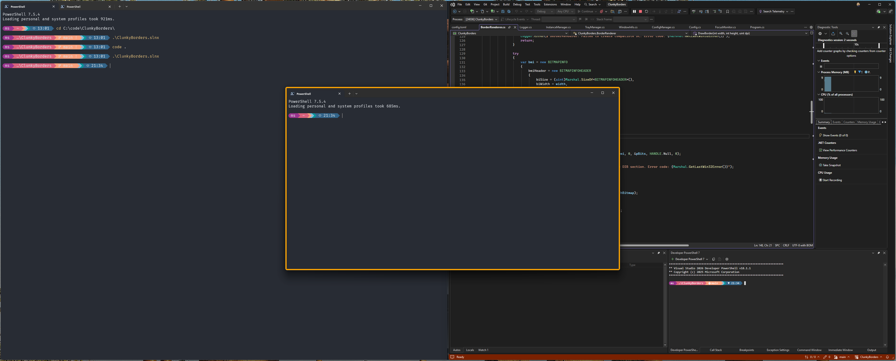

# ClunkyBorders



It’s a lightweight Windows 11 utility that adds a colored border around the currently focused window. This makes it easy to see which window is active, especially when you have several apps open at once.

The application uses native Windows APIs, keeping it small (~3MB) and efficient.

## Why ClunkyBorders?

Modern Windows styling doesn’t provide a clear or consistent indicator for the active window. When working with several apps side by side, it’s easy to start typing only to realize the input went to the wrong application.

While searching for a solution, I found [*JankyBorders*](https://github.com/FelixKratz/JankyBorders), which works great—but it’s only available on macOS.

I couldn’t find a comparable tool for Windows. The closest option was the built-in Windows accent color feature, but it didn’t meet my needs:

- The border is too thin.
- The border color is tied to the title bar color, so changing one changes both.
- Many applications ignore the accent color entirely, leading to inconsistency.

So, I decided to spend a few fun evenings building my own solution 🙂

## Configuration

Default configuration file is `config.toml` uses [TOML](https://toml.io/en/) format. Currently allows configuration of border width and color.

```
[Border]
Width = 5               # in pixels
Offset = 6              # distance from the window edge
Color = 0xFFFFA500      # HEX color in ARGB
```

> **⚠️ Color Issues**
> 
> If the rendered border color doesn't match the color defined in your config file, try disabling window shadows. The border is drawn behind the active window, and shadows are often rendered above it, causing the color to appear dulled or different from what you configured.
>
> **To disable window shadows:**
> 1. Press **Windows + R**, type `sysdm.cpl`, and press Enter
> 2. Go to the **Advanced** tab, click **Settings** under Performance
> 3. In the **Visual Effects** tab, uncheck **"Show shadows under windows"**
> 4. Click **Apply** and **OK**, then restart your PC for changes to take effect


## Usage 

To exit application use tray icon context menu.

## Build

To build and run the project, use:

```ps
dotnet build
dotnet run 
```

To generate a standalone small executable, run:

```ps
dotnet publish -c Release
```

